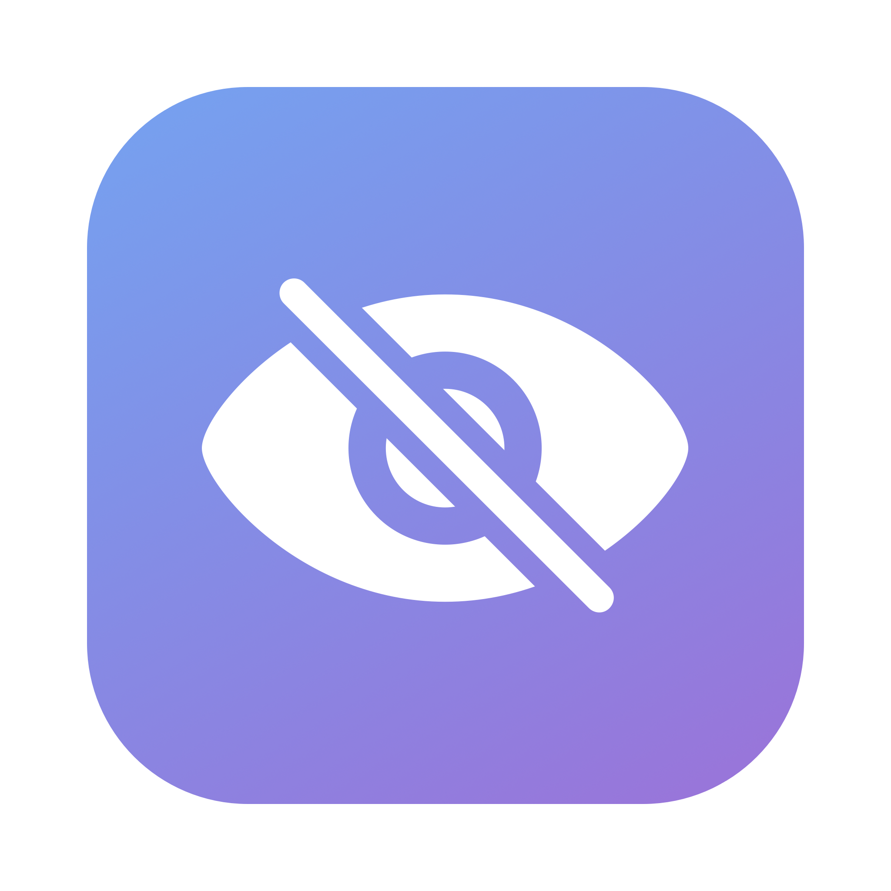

<p align="center"></p>

<h1 align="center">BlurNow</h1>

<p align="center">One click to blur your Mac screen. Touch anything to bring it back.</p>

---

BlurNow is a tiny macOS privacy app. Launch it and every display is covered with a frosted blur, hiding the Dock, menu bar and cursor. Press any key, move or tap the trackpad, scroll, or click, and it fades away.

Think of it as an instant screen saver for when someone walks up behind you.

## Features

- **One click** — put it in the Dock and click to blur.
- **Any input exits** — keyboard, mouse, trackpad, scroll, gestures.
- **All displays** — covers every connected screen.
- **No permissions** — uses the system `NSVisualEffectView` blur, so no Screen Recording or Accessibility access is needed.
- **Tiny** — a single Swift file, no dependencies, no Xcode project.

## Install

Requires macOS 13+ and the Xcode Command Line Tools (`xcode-select --install`).

```bash
git clone https://github.com/YanjieZe/BlurNow.git
cd BlurNow
./build.sh
cp -R BlurNow.app /Applications/
```

Then drag `BlurNow` from `/Applications` into your Dock, or launch it from Spotlight.

## Customize

Edit the constants at the top of [`main.swift`](main.swift), then run `./build.sh` again.

| Setting | Default | What it does |
| --- | --- | --- |
| `gracePeriod` | `0.8` s | Input is ignored for this long after launch, so the click that opened the app doesn't close it. |
| `mouseThreshold` | `6` pt | How far the cursor must move before the blur exits. |
| `blur.material` | `.fullScreenUI` | Blur style. Try `.hudWindow` for a darker, stronger blur. |

## How it works

- One borderless window per screen at `.screenSaver` level, each containing an `NSVisualEffectView` with `.behindWindow` blending. The WindowServer does the blur, so the app never reads screen pixels.
- `LSUIElement` keeps it out of the Dock's running-apps area and the app switcher.
- Exit is triggered by local and global `NSEvent` monitors, a 50 ms cursor-position poll (robust across multiple displays), and losing focus.

## Limitations

- If **Reduce transparency** is on (System Settings → Accessibility → Display), the blur becomes a solid overlay.
- This is a privacy screen, not a lock screen. Anyone who touches the keyboard can dismiss it. Use <kbd>Ctrl</kbd>+<kbd>Cmd</kbd>+<kbd>Q</kbd> when you need a real lock.

## Regenerating the icon

```bash
swift make_icon.swift assets/icon.png
mkdir AppIcon.iconset
for s in 16 32 128 256 512; do
  sips -z $s $s assets/icon.png --out AppIcon.iconset/icon_${s}x${s}.png
  sips -z $((s*2)) $((s*2)) assets/icon.png --out AppIcon.iconset/icon_${s}x${s}@2x.png
done
iconutil -c icns AppIcon.iconset -o AppIcon.icns
```

## License

[MIT](LICENSE)
